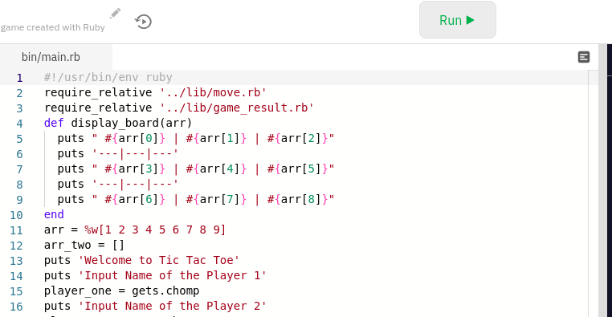
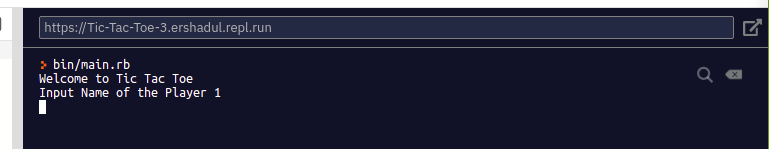
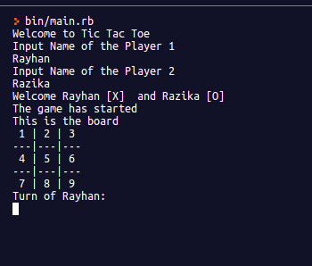
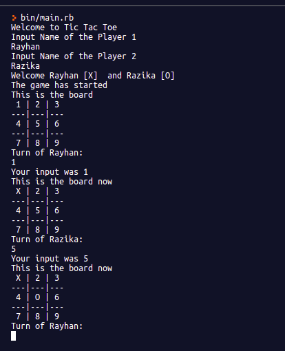
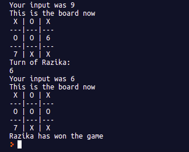
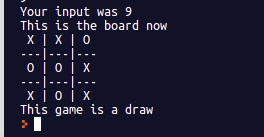

# Tic-Tac-Toe

 In this project we created a Tic Tac Toe game using OOP concepts. We used Ruby to write the game.

 
# What is Tic Tac Toe
 Tic-tac-toe, or Xs and Os is a paper-and-pencil game for two players, X and O, who take turns marking the spaces in a 3×3 grid. The player who succeeds in placing three of their marks in a horizontal, vertical, or diagonal row is the winner.

 In order to win the game, a player must place three of their marks in a horizontal, vertical, or diagonal row. Players soon discover that the best play from both parties leads to a draw. Hence, tic-tac-toe is most often played by young children, who often have not yet discovered the optimal strategy.

# How to play this game?
 Open the live demo [link](https://repl.it/@Ershadul/Tic-Tac-Toe-3#bin/main.rb). Then press the run button on replt.it, as shown in the image below:-
 
 
 
 Input name of two players 

 

 Make your move. You have to input values between 1 and 9

 

 After you have inputted the value, you will see 'X'(Player One) or 'O'(Player Two) in place of your given number. Example given below.

 

 If any player wins you will see this message

 

 If the game has drawn, you will see this message

 

## Requirements

- RUBY

## Live Demo

[Live Demo Link](https://repl.it/@Ershadul/Tic-Tac-Toe#bin/main.rb)

## Getting Started

To get a local copy of the repository please run the following commands on your terminal:

- navigate to your desired directory in your local machine
- clone the repo : `git clone git@github.com:ershadul1/Tic-Tac-Toe.git`
- cd into above cloned directory : `cd Tic-Tac-Toe`
- Now you can do whatever you like to improve the game
- To play the game run this command `bin/main.rb`
- you can use your test codes to test the methods
- add your preferrred test cases in spec folder

## Authors

 👤 **Rayhan**

- Github: [@ershadul1](https://github.com/ershadul1)
- Twitter: [@ErshadulRayhan](https://twitter.com/ErshadulRayhan)
- Linkedin: [ErshadulRayhan](https://www.linkedin.com/in/ershadul-hakim-rayhan-a5a17649/)
- Email:  ershadul.rayhan@gmail.com

👤 **Razika**

- Github: [@rahalrazika](https://github.com/rahalrazika)
- Linkedin : [Razika Rahal](https://www.linkedin.com/in/razika-rahal-85539bbb/)
- Twitter: [@RereRere055](https://twitter.com/RereRere055)

## Contributing

- To contribute to this project:
- Fork this repository & clone locally.
- Create an upstream remote and sync your local copy.
- create a new branch.
- Push your code to your origin repository.
- Create a new Pull Request .

## Show your support

Give a ⭐️ if you like this project!
​
## Acknowledgments

- Microverse
- The Odin Project